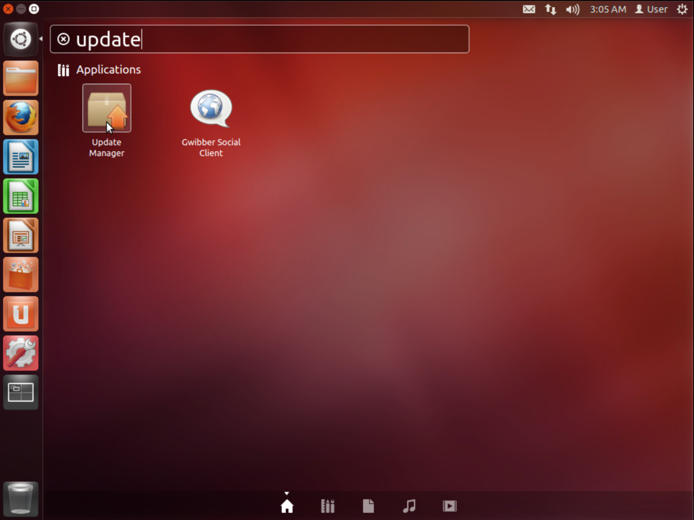
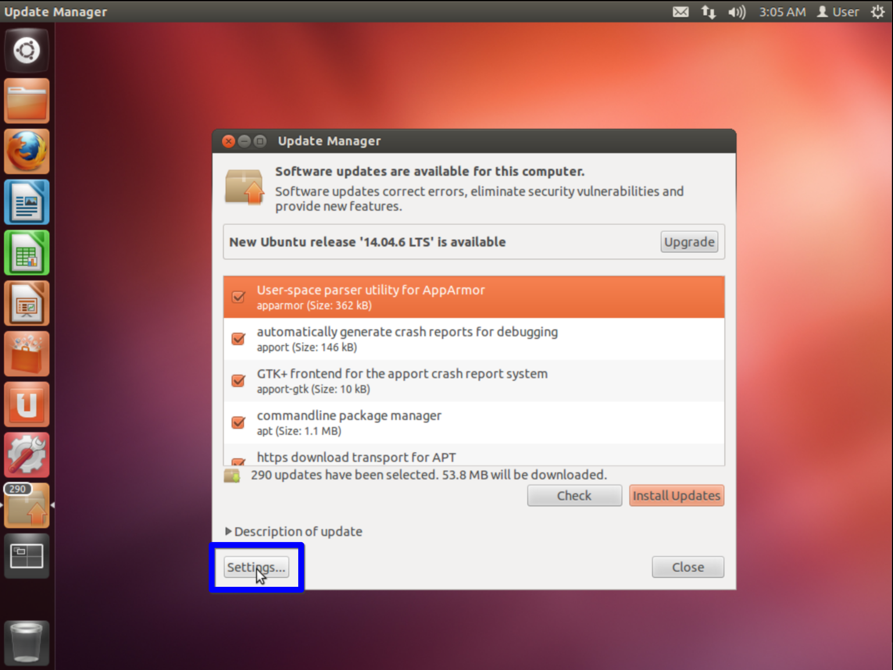
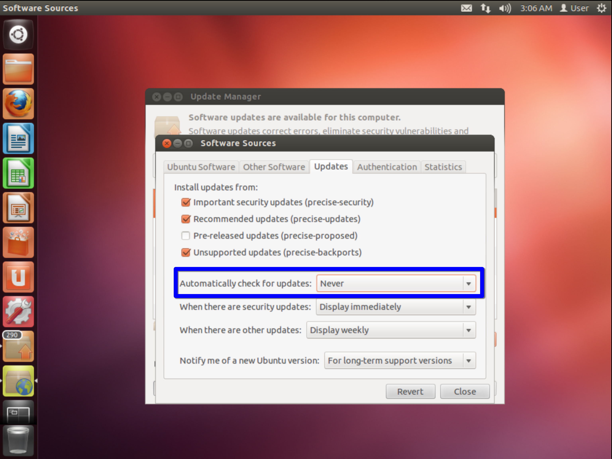

# Ubuntu

## Disable Automatic Updates

Follow the steps in the [page for Debian](./debian.md).

## Disable GUI prompts for updates

Ubuntu has a GUI program that diligently prompts you to update it to the latest Ubuntu release.
However, we usually do not want to update a VM image (as it is storage-inefficient and usually the goal is to preserve the system as-is).
We can disable the GUI prompts for updates by following these steps:

Open `Update Manager` (by pressing the Windows button, then typing `update`).

Click on `Settings...` in the bottom left corner.

The `Updates` tab should be selected by default.
Set the `Automatically check for updates` option to `Never`.

Close the two windows.
Now, there should be no GUI asking for you to update.
