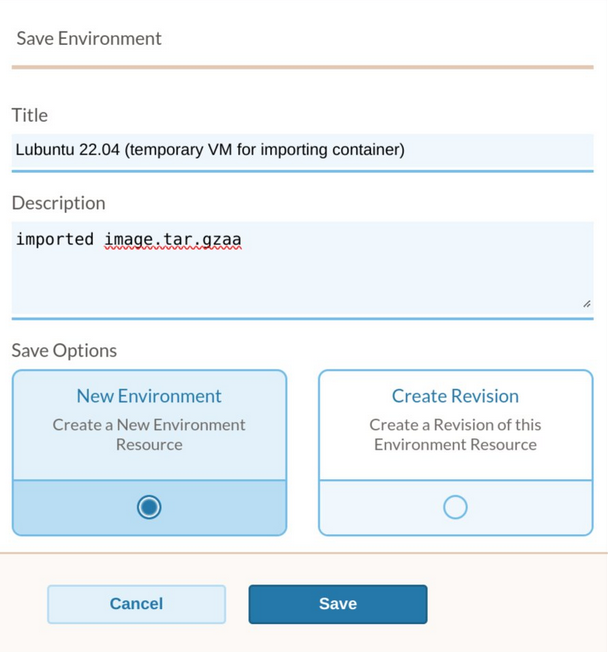

# Upload Software Resource to EaaSI Environment

If the file to upload is smaller than ~2.6 MiB in size, upload it as a single floppy.
Otherwise, upload it as multiple floppies.

## Upload as a Single Floppy

1. Go to "IMPORT RESOURCE" on the left sidebar
2. Click on "Import Software"
3. Add an appropriate name, then click continue
4. Make sure the "PHYSICAL FORMAT" is set to "Floppy"
5. Click on "Finish Import"
6. Go to "EXPLORE RESOURCES" on the left sidebar
7. Search for the Environment that you want to use the uploaded file in
8. Click the checkbox of the Environment to use, and click "Add Software" in the right popup
9. There will be a popup modal. In the dropdown, select the Software Resource that you just uploaded
10. Click "Run." This will start a new VM with the uploaded file attached as a floppy disk.
  - On Linux, data will be in `/dev/fd0` (floppy disk 0). Use `sudo cat /dev/fd0 > tmp_file` to copy it to an on-disk file. An on-disk file is faster to work with than directly with `/dev/fd0`, and saving the contents to an on-disk file works around possible permission issues.

## Upload as Multiple Floppies

We will upload `data.tar`.

1. Try to compress your `data.tar` to reduce size as much as possible: `gzip -9` will make a new `data.tar.gz` in the working directory.
2. Split `data.tar.gz` into multiple ~2.4 MiB files: `split --bytes=2400000 data.tar.gz`. We have `data.tar.gzaa`, `data.tar.gzab`, etc in our working directory.
3. Tar each file. For example, for `data.tar.gzab`, run `tar cf data.tar.gzab.tar data.tar.gzab`.
  - If not tarballed (or is an ASCII text file), EaaSI refuses to start the emulator.
4. Upload each file, following "Upload as a Single Floppy"
  - For every time we upload a file, copy it to disk with `sudo cat /dev/fd0 | tar mxf -`
  - Example:
    1. Run "Lubuntu 22.04" with `data.tar.gzaa`
    2. Save `data.tar.gzaa` to disk, and save as new Environment (do not create a revision, as this feature is broken as of 2025 Feb)
       
    3. Run the new Environment with `data.tar.gzab`
    4. Save `data.tar.gzab` to disk; we now have all required files
    5. Merge the split `data.tar.gzaa` etc files together: `LC_ALL=C cat data.tar.gz?? > data.tar.gz`
    6. Extract the original data from `data.tar.gz`
