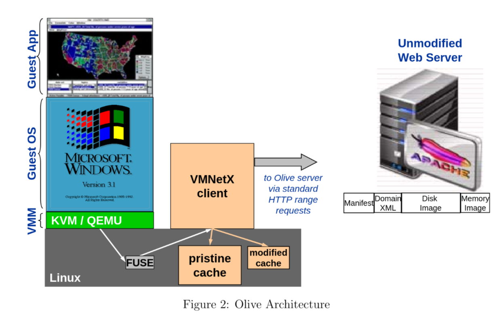

# Olive Archive and Caviar

This directory documents the **Olive Archive** software preservation platform and its client software, including our maintained fork **Caviar**. Olive was developed at Carnegie Mellon University to preserve and deliver legacy software environments.

## Architecture Overview

Olive allows users to run preserved applications—such as historical software, games, or scientific tools—inside full virtual machines (VMs). These VM environments are streamed over the web and executed on the user’s machine. The key components include:

- **VMNetX**: A client that executes virtual machines locally while streaming disk and memory data from a server on demand. This allows for fast startup and minimal local storage.
- **Caviar**: A modern fork of VMNetX developed and maintained as part of this project. Caviar provides improved compatibility with current systems and better support for archival workflows.
- **Guest OS**: The legacy system (e.g., Windows 95, Ubuntu 12.04) being emulated.
- **Host OS**: The modern machine running the VMNetX/Caviar client.
- **Backing store**: A standard web server that hosts disk images and memory snapshots.

The VMNetX (and Caviar) clients mount a FUSE-based filesystem that fetches needed parts of the disk image on-demand. This makes it possible to boot and run legacy operating systems efficiently without downloading full VM images up front.

## Caviar: Modern VMNetX Fork

Because the original VMNetX project is no longer maintained, we created **Caviar**, a fork with updated support for modern systems and workflows.

- Hosted at: [https://github.com/gt-ospo/vmnetx](https://github.com/gt-ospo/vmnetx)
- Caviar includes:
  - Full support for `.nxpk` package files
  - Disk and memory streaming via HTTP Range requests
  - Compatibility with recent Linux distributions and QEMU versions

To get started with Caviar, see the tutorials below.

## Tutorials

I want to...
- [Install and run Caviar](./caviar-installation.md)  
  How to install the Caviar binary and mount remote VM files using FUSE.
- Archive (relatively new) software that uses OpenMPI
  - [Archive Software that uses OpenMPI](./openmpi.md)
- Convert NXPK files (from Olive Executable Archive) to work on Caviar
  - [Import Olive Executable Archive VMs (NXPK files) to Caviar](./import-nxpk.md)
- [Disable Autoupgrade on an OS](./disable-autoupgrade.md)  
  How to disable autoupgrade on a VM OS (e.g., Ubuntu 12.04) to prevent unwanted updates.

## Tutorial: System Requirements For Caviar
- Linux based host OS (within past 5 years)
  - A good choice/example is Ubuntu 24.04.
- QEMU (KVM is more performant, but `qemu-system-x86_64` is ok as well)
  - [QEMU's download webpage](https://www.qemu.org/download/)

- [Import Olive NXPK files](./import-nxpk.md)  
  How to extract and convert Olive `.nxpk` packages and run them using Caviar.

- [Run and explore Debian 12](./caviar-installation.md#tutorial-run-and-explore-debian-12-using-caviar)  
  Launch a working Debian 12 VM streamed on demand via Caviar.

- [Run software with OpenMPI](./openmpi.md)  
  Archive and run MPI-based software inside Olive VMs.

- [Troubleshooting](./troubleshooting.md)  
  Fix common issues such as DNS failures inside VMs.

- [Glossary](./glossary.md)  
  Definitions of terms used in Olive, VMNetX, and Caviar.

## EaaSI vs Olive

We provide a full [comparison of Olive and EaaSI](../other-platforms/eaasi_olive_comparison.md), including differences in architecture, scalability, and emulator support.
