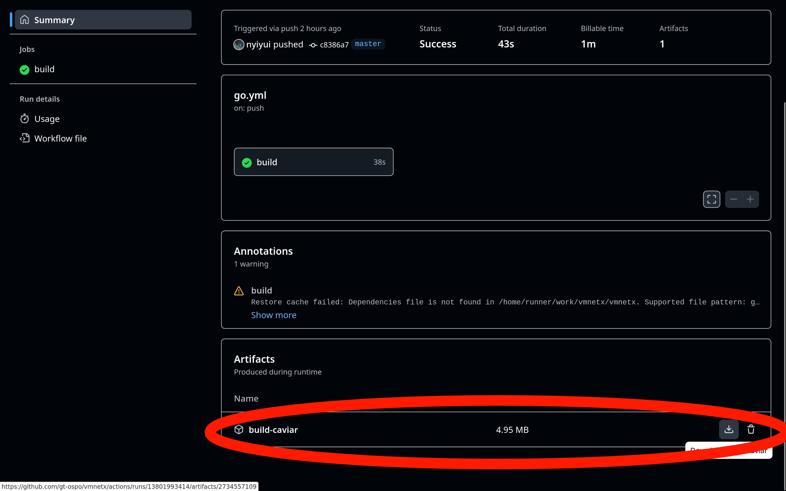

# Olive Executable Archive

- pros
  - less components/software to maintain than EaaSI
    - required: a normal web server to host files (e.g. nginx or apache), and VMNetX client software only
  - OAI-PMH support is probably not that hard to implement
  - can download portions of the VM on demand

## Fork

Our fork of [VMNetX](https://github.com/cmusatyalab/vmnetx.git) (called Caviar) is available here: https://github.com/gt-ospo/vmnetx.git

Current progress:
- can reproduce / run (the original) VMNetX's NXPK files (with caveats, see TODOs section below)

TODOs:
- support NXPK files' memory images

## Comparison to EaaSI

| --- 
| Virtualization Method

## Olive/VMNetX Architecture

To reiterate:
- Olive is a website with a collection of VM images (e.g. Windows 95),
- while VMNetX is the client software that runs the VMs.
- Guest OS is the operating system running inside a virtual machine
- Host OS is the operating system running the virtual machine

The main architecture is as follows:
- KVM/QEMU runs the guest OS
  - Note that KVM/QEMU is just a standard virtual machine
- VMNetX provides access to the guest OS disk
  - In a non-VMNetX setting, this would usually be provided by a VM image (e.g. `.vmdk` or `.qcow2` file), which contains the disk of the guest OS
  - VMNetX downloads required parts of the OS image on-demand (just like how a YouTube video is streamed on-demand)
  - VMNetX can also set an initial memory image
    - We do not have to wait for the OS to boot up
    - We can document a VM along with its memory, making sure we store all necessary state for reproduction
- A standard web server provides the enttire guest OS disk

The below image provides a visual organization of the above.


References:
- http://reports-archive.adm.cs.cmu.edu/anon/2015/abstracts/15-115.html

## Tutorial: Get Started with Olive/VMNetX

Note: we call our fork of VMNetX Caviar, to distinguish it from the original.

1. Download Caviar
  - Go to https://github.com/gt-ospo/vmnetx/actions/workflows/go.yml
  - Click the first green checkmark link 
  - Click the `build-caviar` artifact to download it
  
  - Unzip the file - it should contain an executable `caviar` for your machine
2. Run Caviar - it will mount a FUSE filesystem
  - make sure `caviar` is executable - `chmod +x caviar`
  - `./caviar -mount /caviar`
  - Now, files will be accessible under `/caviar` e.g. `/caviar/6b7a1d0cfeaf2d406d05bf174885b8d2edd7866b733a9aaea79fbddf0466741b` for a Debian 12 image
  - Note: if running many workloads, please run your own mirror by copying the needed files to your own webserver.
  - Note: caviar will not exit - open a new terminal for the following commands

Our setup is done - now we can make a new VM based on Debian 12, and run it.

```
mkdir run-debian-12
cd run-debian-12
qemu-img create -f qcow2 -F qcow2 -b /caviar/6b7a1d0cfeaf2d406d05bf174885b8d2edd7866b733a9aaea79fbddf0466741b debian-12.qcow2
```

We have created a new VM image based on Debian 12. Let's check the file size:

`ls -al debian-12.qcow2`
```
total 10116
drwx------   2 nyiyui nyiyui    4096 Mar 11 23:41 ./
drwxrwxrwt 157 root   root    376832 Mar 11 23:38 ../
-rw-r--r--   1 nyiyui nyiyui  196656 Mar 11 23:39 debian-12.qcow2
```

Now, we can run it:

```
qemu-kvm -m 4096 debian-12.qcow2
# this runs the VM with 4 GiB of RAM
# the VM will run while only part of the full image is downloaded
```


In another terminal, we can check the file size again:

`ls -al debian-12.qcow2`
```
total 9920
drwx------   2 nyiyui nyiyui    4096 Mar 11 23:43 ./
drwxrwxrwt 157 root   root    376832 Mar 11 23:38 ../
-rw-r--r--   1 nyiyui nyiyui 9830400 Mar 11 23:43 debian-12.qcow2
```

We can see that each boot created some log files and other files, that amount to around 10 MiB of new data.
This new data is stored in the `debian-12.qcow2` file, and does not affect the original image at `/caivar/6b7a1d0cfeaf2d406d05bf174885b8d2edd7866b733a9aaea79fbddf0466741b`.

Let's try installing a package, and checking the file size again:


`ls -al debian-12.qcow2`
```
total 250304
drwx------   2 nyiyui nyiyui      4096 Mar 11 23:43 ./
drwxrwxrwt 157 root   root      376832 Mar 11 23:44 ../
-rw-r--r--   1 nyiyui nyiyui 255983616 Mar 11 23:45 debian-12.qcow2
```

Now, the file size has increased to around 250 MiB.
This is because we installed a package, which downloaded and installed many files, as well as changed some existing ones.
Note that this is still smaller than the full size of the image (416 MiB in this case).
