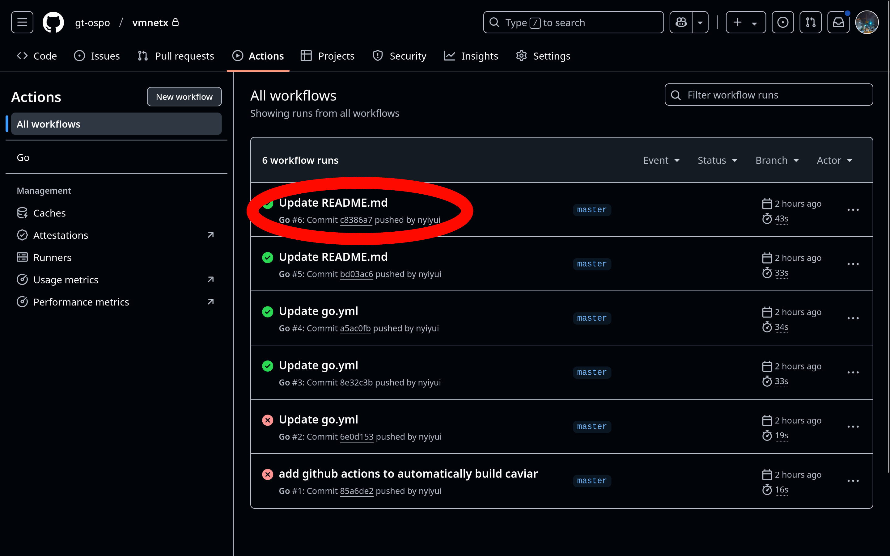

# Olive Executable Archive

## Fork

Our fork of [VMNetX](https://github.com/cmusatyalab/vmnetx.git) (called Caviar) is available here: https://github.com/gt-ospo/vmnetx.git

Current progress:
- can reproduce / run (the original) VMNetX's NXPK files (with caveats, see TODOs section below)

TODOs:
- support NXPK files' memory images
- support NXPK file support on-the-fly (currently requires conversion step)

## Comparison to EaaSI

[A full comparision can be found here.](https://github.com/gt-ospo/oss-software-preservation/blob/main/other-platforms/eaasi_olive_comparison.md)

## Olive/VMNetX Architecture

To reiterate:
- Olive is a website with a collection of VM images (e.g. Windows 95),
- while VMNetX is the client software that runs the VMs.
- Guest OS is the operating system running inside a virtual machine
- Host OS is the operating system running the virtual machine

The main architecture is as follows:
- KVM/QEMU runs the guest OS
  - Note that KVM/QEMU is just a standard virtual machine
- VMNetX provides access to the guest OS disk
  - In a non-VMNetX setting, this would usually be provided by a VM image (e.g. `.vmdk` or `.qcow2` file), which contains the disk of the guest OS
  - VMNetX downloads required parts of the OS image on-demand (just like how a YouTube video is streamed on-demand)
  - VMNetX can also set an initial memory image
    - We do not have to wait for the OS to boot up
    - We can document a VM along with its memory, making sure we store all necessary state for reproduction
- A standard web server provides the enttire guest OS disk

The below image provides a visual organization of the above.


References:
- http://reports-archive.adm.cs.cmu.edu/anon/2015/abstracts/15-115.html

## System Requirements
- Linux based host OS (within past 5 years)
  - A good choice/example is Ubuntu 24.04.
- QEMU (KVM is more performant, but `qemu-system-x86_64` is ok as well)
  - [QEMU's download webpage](https://www.qemu.org/download/)

## Tutorial: Run and Explore Debian 12 using Caviar

Note: In order to distinguish our fork, we have renamed VMNetX to Caviar.

1. The first step is to download Caviar. 
  - (10:00) Go to https://github.com/gt-ospo/vmnetx/actions/workflows/go.yml 
  - (22:04) Click the first green checkmark link  ()
  - (25:40) Click the `build-caviar` artifact to download it
  
2. Next, preform the following setup:
  - Unzip the downloaded file (`build-caviar.zip`) - it should contain an executable called `caviar` for your machine. 
  - Ensure that the `caviar` binary you downloaded from the previous step is executable with the `chmod +x caviar` command. 
  - Make a `/caviar` directory with `mkdir /caviar` 
  - Ensure that the new `/caviar` directory has both read and write permissions by running `chmod ugo+rwX /caviar`
3. In this step, we will Run Caviar - it will mount a [FUSE](./glossary.md) filesystem
  - `cd` to the directory containing your unzipped `caviar` download from step 2. 
  - Run the binary with `./caviar -mount /caviar`. This will mount the Caviar virtual filesystem to `/caviar`; this command should keep running in the terminal. 
  - Now, remote disk images will be accessible in your local `/caviar` directory. 
    - The remote disk images are currently hosted at https://bulletin.nyiyui.ca/2025/03/caviar-store/


Our setup is done - now we can make a new VM and run it. In this tutorial we will be making a Debian 12 virtual machine.

1. Create a directory for your VM files - `mkdir run-debian-12 && cd run-debian-12`
2. Create your VM image - `qemu-img create -f qcow2 -F qcow2 -b /caviar/6b7a1d0cfeaf2d406d05bf174885b8d2edd7866b733a9aaea79fbddf0466741b debian-12.qcow2`
  - Explanation of argument options
    - `qemu-img create` QEMU's utility program for making VM images
    - `-f qcow2 -F qcow2` specify we are using [QCOW2 format](https://www.linux-kvm.org/page/Qcow2) for our VM images - this is required by Caviar
    - `-b /caviar/...` specify the "backing file" of the new VM image we are making; this makes sure we can make edits to our VM disk (as naturally happens when you run an OS), while keeping the disk accessed on-demand
      - `/caviar/...` is the remote VM image we mounted in our setup step 3 - the file does not actually exist on your disk, but is read on-demand as necessary
    - `debian-12.qcow2` the filename of our new VM image

We have created a new VM image based on Debian 12. Let's check the file size:

`ls -al debian-12.qcow2`
```
total 10116
drwx------   2 nyiyui nyiyui    4096 Mar 11 23:41 ./
drwxrwxrwt 157 root   root    376832 Mar 11 23:38 ../
-rw-r--r--   1 nyiyui nyiyui  196656 Mar 11 23:39 debian-12.qcow2
```

Now, we can run it:

```
qemu-kvm -m 4096 debian-12.qcow2
# this runs the VM with 4 GiB of RAM
# the VM will run while only part of the full image is downloaded
```


In another terminal, we can check the file size again:

`ls -al debian-12.qcow2`
```
total 9920
drwx------   2 nyiyui nyiyui    4096 Mar 11 23:43 ./
drwxrwxrwt 157 root   root    376832 Mar 11 23:38 ../
-rw-r--r--   1 nyiyui nyiyui 9830400 Mar 11 23:43 debian-12.qcow2
```

We can see that each boot created some log files and other files, that amount to around 10 MiB of new data.
This new data is stored in the `debian-12.qcow2` file, and does not affect the original image at `/caivar/6b7a1d0cfeaf2d406d05bf174885b8d2edd7866b733a9aaea79fbddf0466741b`.

Let's try installing a package, and checking the file size again:


`ls -al debian-12.qcow2`
```
total 250304
drwx------   2 nyiyui nyiyui      4096 Mar 11 23:43 ./
drwxrwxrwt 157 root   root      376832 Mar 11 23:44 ../
-rw-r--r--   1 nyiyui nyiyui 255983616 Mar 11 23:45 debian-12.qcow2
```

Now, the file size has increased to around 250 MiB.
This is because we installed a package, which downloaded and installed many files, as well as changed some existing ones.
Note that this is still smaller than the full size of the image (416 MiB in this case).
