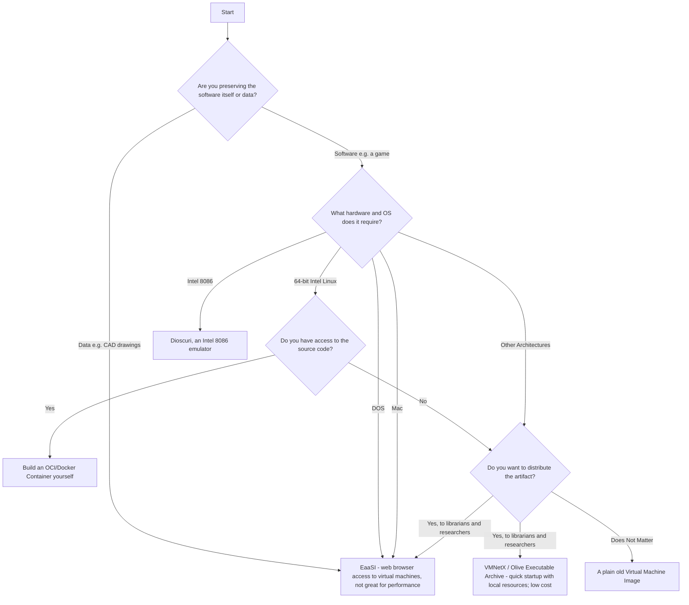

# Software Sustainability Best Practices

This page is meant to collect some resources that you can use to choose what versions of software you should preserve.

When preserving software, it is important to consider the version of the software you are preserving. Different versions of software can have different features, bugs, and compatibility with other software. Preserving the exact version of the software that was used in a project can help ensure that the project can be reproduced in the future.

Additionally, there are many methods for preserving software, from version control systems (e.g. [Git](https://git-scm.com), [Mercurial](https://www.mercurial-scm.org/), [Subversion](https://subversion.apache.org/)) to methods specialized for preservation including the [Internet Archive](https://archive.org/).
Each method has its own strengths and weaknesses, and the choice of method will depend on the specific needs of the project.

## Software Preservation Method Flowchart

TODO

3) Distribute it - should this be "server based distribution" vs "self hosted distribution"?
differentiate distribution platforms
- EaaSI - server hosted
- VMNetX

1) You can technically build a container with an executable (copying over the files from an existing OS). Should this box be different? 

## General Guidance

As a general fact, it is not a usual concern to preserve libraries on their own;
rather, the focus is on preserving the software that uses them.
Therefore, the following guidelines stipulate the version of the software that should be preserved:

- Whenever possible, use the version of the software that is most commonly installed.
  - For C libraries, this is the version that is included in the distribution's package repository.
  - For Python libraries, this is the version that is included in the project's `requirements.txt` or `pyproject.toml` file.
    - If the project does not have a set version for every dependency, note the date of the last changes, and use the latest version of the library that was available at that time.
- If the software reads and writes from a (custom) file format,
  - Pay attention to which version of the software was used to create the file. Many pieces of software do not have backwards compatibility with all files.
  - If this is the case, try the latest patch version of the software that was used to create the files of interest (e.g. files were created with version 1.2.1, so try 1.2.5).

TODO: add specific guidance on saving Python packages
TODO: mention apt mark for keeping certain packages without upgrades

## Resources

- Misc. Resources
  - [Software Preservation Network](https://www.softwarepreservationnetwork.org/)
  - [Software Heritage](https://www.softwareheritage.org/)
  - [Preserving Software](https://www.archives.gov/preservation/digital-preservation/preserving-software)
  - [Internet Archive Collection Development Policy](https://help.archive.org/help/internet-archive-collection-development-policy/)
- Evaluate digital preservation assets
  - [NDSA Levels of Digital Preservation](https://ndsa.org/publications/levels-of-digital-preservation/)
  - [Digital Preservation Handbook](https://www.dpconline.org/handbook/)
